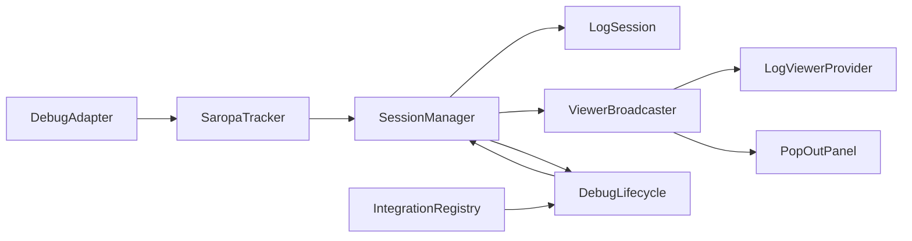

# Saropa Log Capture — System Overview

This document describes how the extension is wired: entry point, activation, capture pipeline, and where config, integrations, and the UI fit in.

## High-level flow

1. **Entry:** `extension.ts` activates the extension, sets the global logger, and calls `runActivation()`. On deactivate it stops sessions, disposes the project indexer and pop-out panel, then disposes editor panels (comparison, analysis, insights, bug report, timeline).

2. **Activation** (`extension-activation.ts`): Registers status bar and session manager, optional project indexer, integration registry (all built-in providers), webview providers (sidebar viewer, vitals, pop-out), broadcaster (fan-out to sidebar + pop-out), session list and bookmarks, config listener, line/split listeners (DAP output → broadcaster + history + inline decorations), shared handler wiring, DAP tracker factory, AI watcher, debug lifecycle, commands, scope context, and webview serializers. Post-activation it runs one-off migrations and gitignore check.

3. **DAP → log file:** VS Code creates a `DebugAdapterTracker` per debug session via `SaropaTrackerFactory`. The tracker receives every DAP message; for `output` events it calls `SessionManager.onOutputEvent(sessionId, body)`. Events that arrive before `startSession()` completes are buffered in `EarlyOutputBuffer` and replayed after the session is created. SessionManager filters by category and exclusions, applies the flood guard, then calls `LogSession.appendLine()` and broadcasts the line to listeners (broadcaster, history, inline decorations). LogSession writes to a file, evaluates split rules, and may split into a new part file (see `log-session-split.ts`).

4. **Debug lifecycle:** `extension-lifecycle.ts` subscribes to `onDidStartDebugSession` and `onDidTerminateDebugSession`. On start it calls `sessionManager.startSession()`, then pushes session info, presets, and viewer state to the broadcaster and history; it also starts the AI watcher if enabled. On terminate it calls `sessionManager.stopSession()`, clears broadcaster/history/decorations, and updates session nav.

5. **Session start/end:** `session-lifecycle.ts` implements `initializeSession` (folder, gitignore, organize/retention, build session context, integration header contributions, create LogSession and start it) and `finalizeSession` (stop log session, run integration end-phase, save auto-tags, run correlation/fingerprint/perf scans, save metadata, refresh index, show summary). The integration registry is called at start (sync header + async fire-and-forget) and at end (meta + sidecars).

6. **Config:** `config.ts` is the single source of truth; `getConfig()` reads from VS Code workspace config and returns a typed `SaropaLogCaptureConfig`. No caching across settings changes; SessionManager keeps a cached snapshot and refreshes it on config change to avoid repeated get() calls per DAP message.

7. **Viewer:** The sidebar `LogViewerProvider` and `PopOutPanel` implement `ViewerTarget`. The `ViewerBroadcaster` forwards every target method to both. Handlers (marker, pause, exclusions, search, bookmarks, session list, etc.) are wired once in `viewer-handler-wiring.ts` and applied to both targets. The webview sends messages to the extension via `viewer-message-handler.ts`, which routes by message type to the context callbacks.

8. **Integrations:** See `docs/integrations/INTEGRATION_API.md`. Providers register with the default registry in activation. At session start the registry gathers header lines (sync) and runs async start (fire-and-forget). At session end it runs `onSessionEnd`, merges meta into `SessionMeta.integrations`, and writes sidecar files next to the log.

## Key files

| Area | Files |
|------|--------|
| Entry / activation | `extension.ts`, `extension-activation.ts`, `extension-lifecycle.ts` |
| Capture pipeline | `tracker.ts`, `session-manager.ts`, `log-session.ts`, `log-session-split.ts`, `session-event-bus.ts` |
| Session lifecycle | `session-lifecycle.ts`, `session-summary.ts`, `session-metadata.ts` |
| Config | `config.ts`, `config-types.ts`, `integration-config.ts` |
| Integrations | `integrations/index.ts`, `integrations/registry.ts`, `integrations/context.ts`, `integrations/providers/*` |
| Viewer host | `log-viewer-provider.ts`, `viewer-broadcaster.ts`, `viewer-handler-wiring.ts`, `viewer-content.ts`, `viewer-message-handler.ts` |
| Commands | `commands.ts`, `commands-deps.ts`, `commands-session.ts`, `commands-export.ts`, … |

## Comment conventions

- **File / module:** 2–4 lines at top describing what the file does and where it fits (callers/callees). Reference ARCHITECTURE.md or INTEGRATION_API.md where helpful.
- **Section:** Use `// --- Section name ---` for logical blocks in long files.
- **Inline:** Brief “why” for non-obvious branches and invariants; avoid restating the code.
- **JSDoc:** Use for exported functions, classes, and key params/returns; add `@remarks` for when/why to call when it helps.
