# Plan 056 — Session Flow Map (screen-transition diagram)

## Status: S1 implemented · S2 in progress (pan/zoom + jump-to-crash shipped 2026-06-10; live log-filtering still proposed)

**S1 (the combined session report) shipped** as the `saropaLogCapture.exportFlowMap` command —
log parser, error-causing-widget parser, static source scan (contacts preset), graph builder
(R1–R6), Mermaid renderer, and report assembler under `src/modules/flow-map/`, with a 13-case unit
test. Verified against the real `20260609_080242_contacts.log`. S2 (interactive webview graph)
remains proposed.

<!-- cspell:disable -->

## Goal

Turn a captured session into a **directed flow diagram** — boxes for each screen / tab /
dialog the user reached, one-way arrows to the next destination, and counters on both. At a
glance the developer sees *where the user went, how often, how long they stayed, and where it
broke* — without scrolling 2,000 log lines.

This is the visualization layer. The capture layer is [plan 052](052_plan-semantic-timeline-capture-and-signal-expansion.md)
(Semantic Timeline Capture). 052 ships the clean nav event stream (`[slc:nav]`, push/pop/replace
with from→to routes); this plan consumes it to draw the graph. The two are siblings — 052's route
ribbon and minimap show the journey **linearly**; this plan shows it as a **graph** where repeated
visits and loops collapse into counted edges.

**The log is only one walked path. The codebase holds the whole graph.** A session log shows the
transitions the user *actually took*; the project source shows every transition that *can* happen,
the human-readable screen names, and the exact file to open for each node. This plan therefore reads
**both** — runtime log/SDK events for what happened, and a static pass over the target project's
source for structure, naming, and code anchors. Nodes and edges are navigable: click a screen → open
its widget; click an edge → open the `.showScreen()` call site that wires those two screens together.

## The WOW — what the diagram is

Concretely, for the real `contacts` session at `reports/20260609/20260609_080242_contacts.log`:

```mermaid
flowchart TD
  Launch([App Launch ×1]):::start --> Home
  Home["🏠 Home<br/>×3 · ~6m"] --> Contact
  Contact["👤 Contact View<br/>James 'JT' Tait<br/>×1 · ~62m · 6 Favorite toggles"]:::hot --> Suggestion["💡 Connection Suggestion ×1"]
  Contact --> Picker["🌐 Culture / Religion Picker<br/>×1 · 💥 crash"]:::crash
  classDef start fill:#2d333b,stroke:#888;
  classDef hot fill:#3a2e1a,stroke:#d08c1a;
  classDef crash fill:#3a1a1a,stroke:#e05252;
```



- **Nodes** = a screen, tab, dialog, or sheet. Box style encodes type (screen / tab / dialog).
- **Node counter** = visit count (`×3`) + total dwell time (`~6m`) + an issue badge when an
  error / crash / slow-query cluster occurred on that node (`💥`).
- **Edges** = a forward transition. **Edge counter** = how many times that transition fired.
- **One-way for clarity** (the explicit design rule, R1 below): back-navigation (pop) is implied,
  not drawn. A↔B never renders as two arrows.

## Design rules

- **R1 — Edges are forward-only and de-duplicated.** A push/replace transition A→B draws one
  directed edge. The matching pop (B→A) is suppressed by default (toggle to show pops faint). An
  A↔B pair never produces two arrows — it stays a single forward edge with a traversal count.
- **R2 — Re-entry is a node counter, not a self-loop.** Re-entering the same screen (hot restart →
  Home ×3, or tab re-selection) increments the node's `×N` badge; it does not draw a loop arrow.
- **R3 — Node identity is the normalized route/screen key**, not the raw label. `/contact/:id`
  with two different ids is **one** node (`Contact View`), counted ×2 — the map shows structure,
  not data. Identity normalization is the one piece of real logic; everything else is aggregation.
- **R4 — Issue overlay is derived, not a separate pass.** A node is flagged when an error,
  unhandled exception, or slow-query/frame-budget cluster falls inside its dwell window. Reuses the
  existing severity classification and signal collectors — no new detection.
- **R5 — Every node and edge carries a source anchor (`file:line`) and is navigable to code.** A
  node anchors to its screen widget's definition; an edge anchors to the `.showScreen()` (or
  `showDialog` / tab-switch) call site that creates the transition. Click → open in editor. Reuses
  the viewer's existing clickable `file.dart:line:col` links (see [stack-parser.ts](../src/modules/analysis/stack-parser.ts)
  + [viewer-stack-frame-click.test.ts](../src/test/ui/viewer-stack-frame-click.test.ts)) — no new link
  infrastructure.
- **R6 — Labels are source-derived, not raw log strings.** A node's display name comes from the
  screen class's declared title (e.g. contacts' `static String get title => l10n.screenContactView`),
  resolved through the project's localization, not from whatever ad-hoc string the runtime happened to
  print. The runtime breadcrumb is the *join key*, not the label source.

## Three data sources

The map is built by joining a **runtime** source (what was walked) with a **static** source (what
the code can do and what it's called). Neither alone is enough: runtime has the timing and the
actual path but ad-hoc labels and gaps; static has the full graph, real names, and code anchors but
no idea what the user actually did.

| # | Source | Kind | Gives | Fidelity |
|---|---|---|---|---|
| **1** | SDK nav events `[slc:nav]` (plan 052) | runtime | exact push/pop/replace, from→to, timestamps | High |
| **2** | App `[log]` breadcrumbs already in the stream | runtime | walked path, dwell timing | Best-effort, app-specific |
| **3** | **Static pass over the target project's source** | static | full possible graph, real screen names, `file:line` anchors | High where conventions hold |

Source 3 is the new pillar and the reason the map can be both **complete** and **navigable**.

### Source 3 — mining the codebase (grounded in the contacts conventions)

A static scan of the analyzed `contacts` project (read-only) found a cleanly minable structure — no
Dart AST needed, regex/heuristic extraction keyed to project conventions is sufficient:

- **Screen registry** — `lib/views/**/*_screen.dart` + `*_tab.dart`; tracked screens are
  `class XxxScreen extends … with ScreenInfoMixin` ([lib/views/screen_info_mixin.dart](../../contacts/lib/views/screen_info_mixin.dart))
  and declare a `static … title` ([example: contact_view_screen.dart](../../contacts/lib/views/contact/contact_view_screen.dart)).
  → one node per screen class, label resolved from the `title`'s l10n key.
- **Possible transitions (edges)** — central push wrapper `ScreenExtensions.showScreen()`
  ([lib/utils/system/screen_utils.dart](../../contacts/lib/utils/system/screen_utils.dart)); grep call
  sites: *enclosing screen* → *pushed screen* is a static edge, anchored to the call-site `file:line`.
- **Tabs** — fully enumerable from `AppTabEnum` (11 tabs,
  [lib/components/main_layout/app_tabs/app_tabs_util.dart](../../contacts/lib/components/main_layout/app_tabs/app_tabs_util.dart)).
- **Activity/nav taxonomy** — `ActivityType` enum
  ([lib/models/audit/activity_type_enum.dart](../../contacts/lib/models/audit/activity_type_enum.dart))
  defines `NavigateScreen`, `NavigateTab`, `NavigateDialog`, `NavigateDialogMainMenu`,
  `NavigateDialogContactView` — the contract behind the runtime breadcrumbs.

These conventions are **project-specific**, so Source 3 is driven by a small per-project config (the
glob for screens, the mixin/base-class marker, the title field name, the push-wrapper symbol). Ships
with a `contacts` preset; other projects add a preset or get a reduced map.

### The join — runtime breadcrumb ↔ screen class ↔ source file

The bridge that makes nodes navigable: the runtime breadcrumb metadata *is* the screen's static
`title`. `Screen Navigation: Contact View` came from `widget.logNavigation(ContactViewScreen.title)`
inside `ScreenInfoMixin`. So the join is: **breadcrumb string → matching screen `title` → screen
class → `*_screen.dart` file**. Once joined, the runtime node inherits the static node's real name
(R6) and code anchor (R5). Unmatched breadcrumbs stay as runtime-only nodes flagged `unresolved`.

### Possible-graph vs walked-graph overlay (the upgraded WOW)

Because Source 3 yields the *whole* graph, the diagram can render the full app structure faintly and
**highlight the path this session actually walked** — solid, counted edges over a gray scaffold.
"Here is every screen and how they connect; here is where this user went, how often, and where it
broke." That overlay is impossible from the log alone and is the headline differentiator.

### Crash attribution without a breadcrumb — correcting the prior turn

Last turn I said the crashing dialog was knowable only from the raw stack. That was wrong. Flutter's
error report names it explicitly:

```
The relevant error-causing widget was:
    ListView … file:///D:/src/contacts/lib/components/contact/culture/culture_religion_picker_dialog.dart:101:14
```

A small new parser for the `The relevant error-causing widget was:` line extracts that `file:line`,
and the static scan maps the file back to its dialog/screen — so the crash node is created and
anchored to source **even though the app emitted no navigation breadcrumb for that dialog**. This is
exactly the gap where the project should *surface more metadata*: the culture/religion picker is
invoked ad-hoc via `showCultureReligionPickerDialog()` with no `NavigateDialog` log. Closing it is a
one-line app-side addition (log `ActivityType.NavigateDialog`) or adoption of 052's SDK — both are
"project surfaces a richer tag" paths, and the plan recommends them rather than guessing dialog
membership statically.

## Rendering — two surfaces, one model

Both surfaces render from the same `FlowNode/FlowEdge` model, so they can never disagree. They serve
different contexts: a **portable report** for handoff, and a **live graph** for in-IDE exploration.
The report is itself the combined artifact — diagram *and* tables *and* narrative in one document; it
is not a third separate thing.

- **S1 — Session report (combined, ships first).** A new command `saropaLogCapture.exportFlowMap`
  writes one Markdown document beside the `.log` (and a copy-to-clipboard variant), structured as:
  1. **Flow diagram** — the `flowchart TD` Mermaid block (renders in VS Code's Markdown preview and
     on GitHub; zero new runtime dependency).
  2. **Screen dwell table** — per node: visits, total dwell, entered/left, issue badge.
  3. **Performance / warnings / errors table** — slow-query clusters, warnings, the crash, each with
     its `file:line` anchor.
  4. **Narrative** — a few generated sentences summarizing the journey (the "story" paragraph).

  This is the full session map I produced in chat, with the diagram on top — portable into a bug
  report, GitHub issue, or Slack, and it slots directly into 052's Crash Context section. Shipping it
  first proves the data model on real logs with no UI risk.
- **S2 — Interactive webview graph (the headline, added later).** A panel in the existing viewer
  rendering the same model as a pan/zoom SVG — the *live lens* a static document can't be. Click a
  node → jump to its widget in the editor (R5) or filter the log to its dwell windows (reuses the
  existing filter pipeline per `.claude/rules/global.md` "Webview Viewer Filters"). Hover an edge →
  transition times + jump to the `.showScreen()` call site. Node size ∝ dwell time; crash nodes
  pulse; the possible-vs-walked overlay is interactive. A collapsible side panel shows the same dwell
  / issue tables as S1, so the panel is self-sufficient. **Layout needs a directed-graph layout
  algorithm** — see Open Question 1 (likely a new dependency, a blast-radius decision, not a silent
  add).

S1 first, then S2 — S2 *adds* the interactive lens; it does not replace the report.

## Scope

### In scope
- Flow-graph data model: `FlowNode` (key, label, type, visits, dwellMs, issues[], `source: {file,
  line}`, walked?) and `FlowEdge` (from, to, count, `source: {file, line}`, walked?, inferred?).
- Builder that folds runtime events (Source 1 or 2) over the static graph (Source 3), applying R1–R6.
- **Static source scanner** — per-project config (screen glob, mixin marker, title field,
  push-wrapper symbol, tab enum); ships a `contacts` preset. Extracts screen registry, possible
  edges, tab list, and `file:line` anchors. Regex/heuristic, no Dart AST.
- The runtime↔source **join** (breadcrumb → `title` → screen class → file) and `unresolved` fallback.
- **Error-causing-widget parser** — extract `file:line` from the `The relevant error-causing widget
  was:` line so crash nodes anchor to source without a breadcrumb.
- Route/screen identity normalization (R3) with a small, testable rule set.
- Possible-graph vs walked-graph overlay rendering.
- S1 Mermaid exporter + command. S2 interactive webview panel (settings-gated), with click-to-code
  on nodes and edges (reusing existing file-link handling).
- Issue overlay sourced from existing severity classification + signal collectors.

### Out of scope
- Capturing the runtime events — that is plan 052. This plan assumes the timeline exists (Source 1)
  or best-effort breadcrumbs (Source 2).
- Full Dart AST analysis / a language server. Source 3 is regex/heuristic over project conventions;
  apps that don't follow a discoverable convention get a reduced (runtime-only) map, not a guess.
- Editing the target project to add metadata. The plan *recommends* where a project should surface
  more tags (e.g. the unlogged culture dialog), but does not make those edits — that is the app's.
- Cross-session aggregate maps. Single-session only; multi-session is a follow-up.
- Editing / annotating the graph. Read-only visualization.
- Replacing 052's linear route ribbon or minimap. This is **additive**.

## Open questions

1. **Layout dependency.** The interactive graph (S2) needs layered directed-graph layout. Options:
   (a) reuse Mermaid's renderer in the webview, (b) add `dagre` (~standard, small), (c) hand-roll a
   layered layout for the small graphs sessions produce (typically <30 nodes). Each is a real
   trade-off; (b) is a **new dependency** and per `.claude/rules` needs explicit sign-off before
   adding. Recommendation: ship S1 (Mermaid export, no dep) first, defer the S2 dependency decision
   until the data model is proven.
2. **Fold into 052 or stand alone?** This is filed standalone because its data-extraction story
   works on existing logs (Source 2 + 3) independent of 052's SDK, and its surface (a graph) is distinct
   from 052's linear ribbon. If 052 lands first, S1 becomes a thin consumer of its timeline items.
3. **Source-3 conventions are app-specific.** The screen glob, `ScreenInfoMixin` marker, `title`
   field, `showScreen` wrapper, and `AppTabEnum` are `contacts` conventions. The config shape (and
   how a new project authors a preset) must be decided before Source 3 generalizes beyond `contacts`.
4. **Scan live vs. index.** Does the static scan run on demand when a flow map is opened, or is the
   screen/edge graph indexed once per project (under the existing `.saropa/index/`) and refreshed on
   source change? On-demand is simpler; an index is faster for repeat opens and large projects.
   Recommendation: on-demand first, index later if scan cost shows up.
5. **Metadata signals are additive layers, not alternatives — support all, merge by precision.**
   Each signal a project provides makes the map sharper; none replaces or disables another, and a
   project never loses functionality by adopting more. The builder merges all available signals in a
   precedence chain, highest-confidence wins per field:
   1. **Static scan (Source 3)** — always on, zero app change. Screens, possible edges, names, anchors.
   2. **`ActivityType.NavigateDialog` logging** — app logs the call site; resolves ad-hoc dialogs the
      scan can't (the culture/religion picker). One-line app-side add, purely additive.
   3. **SDK `[slc:nav]` (052)** — exact push/pop/replace and timing; upgrades runtime fidelity.
   4. **Project-exported screen/dialog registry** — authoritative names/edges where a project wants
      to be explicit; overrides heuristic labels.
   The only open decision is which layer the docs *nudge* app authors toward first (recommend
   NavigateDialog logging for dialogs now, SDK long-term) — not which to build. Build the merge chain;
   it degrades gracefully with whatever is present.
6. **Dwell-window attribution for issues (R4).** When the active node at error time is unknown,
   attribute to the last known node or an explicit `?` node? Default: last known node, flagged
   `inferred` — but the error-causing-widget parser often resolves it to a real source node first.

## Project log-tag protocol — `[flowmap]` (implemented)

To capture **every** screen/tab/dialog/sheet reliably — not just the ones that happen to emit an
app-specific breadcrumb, and with the source file even for surfaces the screen scan can't resolve
(ad-hoc dialogs) — a project emits one log line per surface entered:

```
[flowmap] enter <screen|tab|dialog|sheet|inline> "<Name>" [<lib/path/to/file.dart:line>]
```

Examples:

```
[flowmap] enter tab    "Home"           lib/views/home/home_tab.dart:131
[flowmap] enter screen "Contact View"   lib/views/contact/contact_view_screen.dart:226
[flowmap] enter dialog "Culture Picker" lib/components/contact/culture/culture_religion_picker_dialog.dart:101
```

The parser ([flow-map-breadcrumbs.ts](../src/modules/flow-map/flow-map-breadcrumbs.ts)) recognizes
the tag and produces a node-creating event carrying the declared **kind** and **source** anchor; the
builder honors both (the explicit tag is the highest-confidence signal, above the static scan and
ad-hoc breadcrumbs). The `file:line` is optional — names still produce nodes without it — but
supplying it makes every node navigable to code.

Recommended emission: a `NavigatorObserver` (push/pop) logs the tag for screens/tabs automatically;
`showDialog` / `showModalBottomSheet` wrappers log it for dialogs/sheets. This is the lightweight,
no-SDK path; [plan 052](052_plan-semantic-timeline-capture-and-signal-expansion.md)'s structured
`[slc:nav]` events are the richer long-term form.

## Files touched (anticipated)

- **New** (extension)
  - `src/modules/flow-map/flow-map-model.ts` — `FlowNode` / `FlowEdge` types (incl. `source` anchor)
  - `src/modules/flow-map/flow-map-builder.ts` — runtime ⊕ static graph (R1–R6)
  - `src/modules/flow-map/flow-map-identity.ts` — route/screen normalization (R3)
  - `src/modules/flow-map/flow-map-source-scan.ts` — Source 3 static scanner + per-project config
  - `src/modules/flow-map/flow-map-presets.ts` — convention presets (ships `contacts`)
  - `src/modules/flow-map/error-causing-widget-parser.ts` — crash-node source anchor
  - `src/modules/flow-map/flow-map-mermaid.ts` — S1 exporter
  - `src/ui/panels/flow-map-panel.ts` — S2 webview panel (click-to-code on nodes/edges)
- **Modified**
  - `src/modules/bug-report/bug-report-formatter.ts` — embed the Mermaid block in reports
  - `package.json` — `saropaLogCapture.exportFlowMap` command, `saropaLogCapture.flowMap.*` settings
    (incl. the per-project convention config)
  - `CHANGELOG.md`, `ROADMAP.md`

## Verification checklist

A workstream is **not done** until every check passes.

### Data model + builder
- [ ] Fixture timeline (Source 1, 12 nav events with 2 repeated transitions) builds the expected
      node/edge set with correct visit and traversal counts.
- [ ] R1: an A→B→A sequence produces **one** edge A→B, not two; the pop is suppressed.
- [ ] R2: three entries of the same route produce one node with `visits === 3` and **no** self-loop.
- [ ] R3: two `/contact/:id` routes with different ids collapse to one node counted ×2.
- [ ] R4: an error inside a node's dwell window flags that node; an error outside all windows is
      attributed per Open Question 4 and marked `inferred`.

### S1 Session report (combined)
- [ ] `exportFlowMap` on the real `20260609_080242_contacts.log` produces one Markdown document with
      all four sections: valid `flowchart TD` (renders in VS Code preview, crash node styled
      distinctly), dwell table, perf/warnings/errors table, and a narrative paragraph.
- [ ] Every table row with a source location carries a clickable `file:line` anchor.
- [ ] Export on a session with zero recognized screens still produces a valid document — diagram
      replaced by an explicit "no navigation captured" note, tables/narrative built from what exists,
      never an empty/broken file.

### Source 3 — static scan + code navigation
- [ ] Scan of `contacts` produces a screen registry from `*_screen.dart` + `ScreenInfoMixin`, each
      node carrying a resolved title label and a `file:line` anchor.
- [ ] Possible edges are extracted from `.showScreen()` call sites with the call-site anchor.
- [ ] `AppTabEnum` yields all 11 tab nodes.
- [ ] Join: breadcrumb `Contact View` resolves to `ContactViewScreen` → `contact_view_screen.dart`;
      an unmatched breadcrumb is flagged `unresolved`, not silently dropped.
- [ ] Error-causing-widget parser extracts `culture_religion_picker_dialog.dart:101` from the real
      crash report and creates an anchored crash node with no breadcrumb present.
- [ ] Clicking any node or edge opens the anchored `file:line` in the editor.
- [ ] A project with no preset produces a runtime-only (reduced) map, not an error and not a guess.

### S2 interactive panel
- [ ] Clicking a node filters the log to that node's dwell windows.
- [ ] Crash node is visually distinct and reachable by a single "jump to crash" action.
- [ ] Possible-vs-walked overlay: static-only edges render faint, walked edges solid + counted.
- [ ] Graph with 30 nodes lays out without overlap and pans/zooms without lag.

### Runtime honesty
- [ ] Inferred / gap transitions render dashed (or as `?` nodes), never as solid edges — the map
      must not imply certainty it does not have.

## Why a graph and not just the linear timeline

052's route ribbon answers "what was the sequence?". A flow graph answers a different question:
"what is the **shape** of this session?" — which screens are hubs, which transition is hammered,
where loops form, which node carries the crash. Repetition (Favorite toggled six times, Home entered
three times across hot restarts) is noise in a linear list and **signal** in a graph: it becomes a
counter on one node instead of six scattered lines. That collapse is the whole value.

## Finish Report (2026-06-09)

**Scope:** (B) VS Code extension (TypeScript). This pass built out the **S1 webview panel** beyond the
initial command — the native dashboard report — plus a series of UX iterations requested
interactively. S2 (interactive graph as a standalone panel) remains **proposed/open**, so this plan
stays active.

**Reviewed by another AI.**

### What landed in this pass
- **Native report panel** (`src/ui/panels/flow-map-panel.ts` + `-styles.ts` + `-script.ts`) — opens
  the report in VS Code instead of forcing a file save; a top-right save icon writes the portable
  `.md` on demand.
- **Self-generated SVG diagram** (`flow-map-svg.ts`) — no Mermaid/dagre dependency, offline; the
  saved `.md` keeps the Mermaid block for GitHub rendering. Per-kind node icons; pulsing crash node.
- **Dashboard polish** — colored stat pills in a sticky top bar, section TOC, collapsible `<details>`
  sections, clean row-separator tables (no grid), proportional dwell bars, severity-accented rows,
  responsive flow/narrative two-column layout.
- **Log linking (R5 extended to the log)** — log line numbers are threaded through model → parser →
  builder; every dwell/issue row and each diagram node links to its source `file:line` (opens in
  editor) AND its originating log line (reveal in the viewer via `scrollToLine`, or copy the raw
  line).
- **Toolbar entry point** — the redundant in-log search icon was replaced by a flow-map button
  (committed earlier in `66694903`).
- **ANSI corruption fix** — Flutter colorizes output (`allowAnsiColorOutput`), so breadcrumbs arrived
  wrapped in `[..m` codes that rendered as `□[32m…` and broke anchored matchers. `stripAnsi`
  now runs at ingest (parser) and again defensively at render (`flow-map-format`, `flow-map-html`).
  Verified: 0 ESC bytes in the rendered body against the real log.
- **Tall-diagram fix** — `.diagram` is height-capped (`max-height: 70vh`, `overflow:auto`, user
  `resize: vertical`) so a very tall flowchart scrolls in its own pane instead of pushing the tables
  off-screen; the TOC and collapsible sections also reach them.

### Verification
- `npm run check-types` — 0 errors. New/changed flow-map files lint clean and under the 300-line cap.
- Flow-map unit test (`src/test/modules/flow-map/flow-map.test.ts`) — **16 cases passing**, incl. a
  new ANSI-stripping regression case and SVG/webview-body assertions.
- `npm run compile` — NLS 476 keys ×11 aligned, webview + command catalogs match, `dist/extension.js`
  4.60 MiB (no dependency added).
- End-to-end against `d:\src\contacts\reports\20260609\20260609_080242_contacts.log`: 5 clean nodes,
  crash anchored to `culture_religion_picker_dialog.dart:101`, 11 log links, 0 ESC.

### Not committed here (intentional)
- `CHANGELOG.md` is shared with a concurrent **"Open Log File / loaded-files-history"** workstream
  (its entry sits alongside the flow-map entry). To avoid bundling another workstream's code, the
  flow-map CHANGELOG entry is written but left uncommitted in this pass.
- The session-list / `loaded-files-history` files in the working tree belong to that other
  workstream and are **excluded** from this commit.

### Outstanding
- **S2** — interactive graph (pan/zoom, live filtering) remains proposed.
- On-device/manual verification of the live panel interactions (reveal-in-log, copy, collapse, TOC,
  resize) is the user's F5 check — see the "What to test" handoff.

## Finish Report (2026-06-09) — diagram + parser (#4–#7, `[flowmap]` tag)

**Scope:** (B) VS Code extension. The diagram/parser half of a 7-request refinement round; the panel
half (#1 stats→Session-info rows, #2 TOC chips, #3 top log path) shipped in commit `4e157361`
alongside the concurrently-built Activity chart. Reviewed by another AI. S2 stays proposed.

- **#4** circular visit badge on each node's top-right corner, replacing inline `×N`
  ([flow-map-svg.ts](../src/modules/flow-map/flow-map-svg.ts) `visitBadge`).
- **#5** dropped the confusing "View" action — `Viewed Contact Detail` is now `lifecycle`, so a
  screen shows only its visit count, not a duplicate `1 View`
  ([flow-map-breadcrumbs.ts](../src/modules/flow-map/flow-map-breadcrumbs.ts)).
- **#6** `[flowmap] enter <kind> "<Name>" [file:line]` capture tag — parser → node event with
  declared kind + source; builder honors both (highest-confidence). Captures dialogs/sheets the
  screen scan can't resolve, with source. Protocol documented above. (`flow-map-breadcrumbs.ts`,
  `flow-map-builder.ts`, `flow-map-model.ts`.)
- **#7** dwell moved onto the edges (time on the source screen labels the connecting line);
  `nodeDisplayLines(withCounter=false)` drops the node's inline counter for the SVG, Mermaid keeps it
  (`flow-map-format.ts`, `flow-map-svg.ts`).

Note: an interleaved Claude session transiently reverted then restored these files mid-session; final
state verified present and stable.

**Verification:** `check-types` clean; `flow-map.test.js` **18 passing**; functional run confirms no
`View` action, `[flowmap]`→dialog node with source, badges render, edge dwell labels present.
**Not committed:** unrelated concurrent workstreams (session-list, loaded-files, name-filter,
about, URL-open) and shared `CHANGELOG.md` / `strings-*.ts` / `plans/reference/*`.

## Finish Report (2026-06-10) — S2 first interactive increment (pan/zoom + jump-to-crash)

This work will be reviewed by another AI.

**Scope:** (B) VS Code extension (TypeScript — flow-map webview panel HTML/CSS/JS + l10n + test). No Dart/Flutter app code.

**What shipped.** The flow-map panel already rendered a self-generated SVG (no Mermaid/dagre dependency) with click-to-code and reveal-in-log. The diagram was static, though. S2's headline — "a live lens a static document can't be" — now has its first interactive increment, with **no new dependency** (Open Question 1's layout-dependency decision stays deferred; the hand-rolled SVG already solves layout):
- **Pan** — drag the diagram background to pan (viewBox translate). Node clicks are untouched: panning only starts when the pointer-down target is not inside a `.fm-node`, and a drag that moved past a 3px threshold suppresses the trailing click so a node underneath the release isn't triggered.
- **Zoom** — mouse wheel zooms cursor-anchored (the point under the cursor stays fixed); +/− overlay buttons zoom about the center. Clamped to 0.2×–3× of the author viewBox so the graph can't invert or vanish.
- **Reset / fit** — `⧉` restores the author viewBox (the fit-to-content state).
- **Jump to crash** — `💥` centers the viewBox on the `.fm-crash` node (with a little zoom) and flashes it; the control only renders when a node carries an error, so it is never dead.
- All of this is **purely additive** over the existing horizontal-scroll fallback and the node-click → row-highlight + log-jump behavior, which are unchanged.

**Files changed:**
- `src/modules/flow-map/flow-map-html.ts` — overlay zoom toolbar inside `.diagram` (jump-to-crash gated on `graph.nodes.some(nodeHasError)`); imports `t` + `nodeHasError`.
- `src/ui/panels/flow-map-panel-script.ts` — viewBox pan/zoom engine, wheel + pointer-drag handlers, toolbar wiring, crash-centering with flash.
- `src/ui/panels/flow-map-panel-styles.ts` — `.diagram` positioned; `.fm-zoom-toolbar` / `.fm-zoom-btn` styles; grab/grabbing cursors; `fm-flash` keyframe (+ reduced-motion exemption).
- `src/l10n/strings-b.ts` — `flowMap.zoomInBtn`, `zoomOutBtn`, `resetViewBtn`, `jumpToCrashBtn`.
- `src/test/modules/flow-map/flow-map.test.ts` — 2 new cases (toolbar present + crash control gating).
- `CHANGELOG.md` — `[Unreleased]` Changed entry.

**Tests:** `flow-map.test.js` → 23 passing (+2 new). `npm run check-types` clean; `npm run lint` no new warnings (changed files under the 300-line cap); `npm run compile` passes all verify gates; no dependency added (`dist/extension.js` 4.61 MiB).

**Outstanding (S2 still proposed):** click-a-node → filter the *main log viewer* to that node's dwell windows (cross-webview into the viewer's filter pipeline); interactive possible-vs-walked overlay toggle; and the 30-node layout/perf check. The pan/zoom interactions are verified by unit tests at the HTML/wiring level but not yet exercised on a device — that is the user's F5 check. Plan stays active.

**Finish report appended:** plans/056_plan-session-flow-map.md
