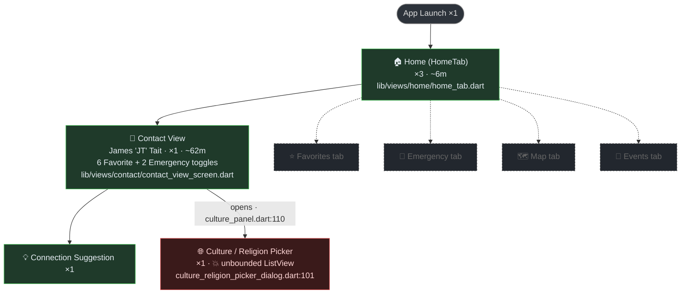

# Session Report — contacts · 2026-06-09 08:02

> **Hand-authored reference sample** for [plan 056](056_plan-session-flow-map.md). This is the exact
> shape the `saropaLogCapture.exportFlowMap` command (S1) will generate automatically — diagram,
> tables, narrative in one portable document. Built by hand from
> `d:\src\contacts\reports\20260609\20260609_080242_contacts.log` (2,243 lines) to prove the format
> on real data and serve as the verification fixture. Source `file:line` anchors are relative to the
> target project root `d:\src\contacts`.

**Session:** contacts · `feat/flutter-contacts-v2-migration` @ `f2e5d74efb` (dirty)
**Device:** motorola edge 2022 (android-arm64) · Flutter debug · Impeller/Vulkan
**Captured:** 2026-06-09 08:02:42 → 09:12:57 (~70 min wall) · Saropa Log Capture v7.18.0
**Outcome:** 💥 1 unhandled rendering exception · 135 slow queries · 0 crashes recovered

---

## Flow

Solid = walked this session (with visit/traversal counts). Faint dashed = exists in code but not
visited this session (from the static scan of `AppScreenEnum` / `AppTabEnum`). 💥 = fault occurred
on this node.

The graph collapses the noise: Home entered three times (two hot restarts) is one node ×3; the
six Favorite toggles are a counter on Contact View, not six scattered lines. The crash node is
anchored to source even though the app logged **no** navigation breadcrumb when the dialog opened —
its `file:line` came from the Flutter error report's *relevant error-causing widget* line, and the
opening edge from the `showCultureReligionPickerDialog()` call site in the static scan.

---

## Screen dwell

| Screen / phase | Type | Entered | Left | Duration | Visits | Source |
|---|---|---|---|---|---|---|
| Build + launch | — | 08:03:25 | 08:04:40 | ~1m15s | 1 | — |
| Home | tab | 08:04:58 | 08:10:57 | ~6m (cumulative) | 3 | `lib/views/home/home_tab.dart` |
| Contact View — James 'JT' Tait | screen | 08:10:57 | 09:12:55 | ~62m (active ~28m, idle ~34m) | 1 | `lib/views/contact/contact_view_screen.dart:245` |
| Connection Suggestion | inline | 08:38:01 | — | brief | 1 | within Contact View |
| Culture / Religion Picker | dialog | 09:12:55 | 💥 | crashed on open | 1 | `lib/components/contact/culture/culture_religion_picker_dialog.dart:101` |

Two hot restarts inflate the Home visit count: launch #1 Home at 08:04:58 → restart 08:08:04 →
restart 08:08:09 → Home again 08:08:17.

---

## Performance · warnings · errors

| Time | Sev | What | Detail | Source |
|---|---|---|---|---|
| 08:03:55 | ⚠️ warn | Build | Kotlin-Gradle Plugin deprecation (20 plugins) | build |
| 08:04:54 | 🐢 perf | Slow query | **Drift SLOW 2830ms** INSERT activities — worst of session | `lib/database/drift/drift_debug_interceptor.dart:195` |
| 08:04:56 | 🐢 perf | Slow burst | ~1028–1031ms `user_preferences` / `user_permissions` SELECTs at startup | `drift_debug_interceptor.dart:195` |
| 08:05:09 | ⚠️ warn | Cache misuse | `getCachedValue()` called before cache init ×8 | `UserPreferenceCacheService` |
| 08:05:30–35 | ⚠️ warn | Decode | `databaseDecode` could not decode JSON ×3 (emergency services) | — |
| 08:27:31 | ⚠️ warn | Tiles | OpenStreetMap tile-usage policy ×2 (flutter_map) | — |
| 08:38:33 | ⚠️ warn | Render | `E/FrameEvents: applyFenceDelta: Unexpected fence` | device |
| 09:12:55 | 💥 **error** | **Crash** | **Vertical viewport given unbounded height** — `ListView` nested in unbounded scrollable | `lib/components/contact/culture/culture_religion_picker_dialog.dart:101` |

**Session totals:** 135 `Drift SLOW` + 19 `REPEAT` batches — dominated by repeated single-key
`user_preferences IN (?)` reads (N+1 shape). The viewer's "E 119" error count is inflated by the
crash's ~150-frame stack and repeated `E/` Android lines; there is exactly **one** real app fault.

---

## Narrative

A debug session on a motorola edge 2022. The app cold-built and launched (08:03:25 → first frame
08:04:40), then ran a heavy first-run startup — caches, Google SDK, public-holiday import, database
cleanup, ~30 organization industry updates — punctuated by a 2.8-second activities INSERT and a burst
of ~1-second preference reads. It was **hot-restarted twice** around 08:08, landing back on Home each
time.

At 08:10:57 the user opened **James 'JT' Tait's** contact and stayed there for the rest of the
session. They toggled **Favorite** six times in 13 seconds (off/on, indecisive or testing), flipped
**Emergency** on-then-off, and viewed a connection suggestion. The app was backgrounded and
foregrounded twice, then sat **idle for ~34 minutes**.

On return, opening the **culture / religion picker** dialog from the Contact View detail panel threw
the session's only real fault: a `ListView` given unbounded height because it sits inside another
scrollable. The dialog left no analytics breadcrumb — the map recovered it from the crash report and
the static call-site scan. **The one actionable bug is the unbounded-height `ListView` at
`culture_religion_picker_dialog.dart:101`.**
